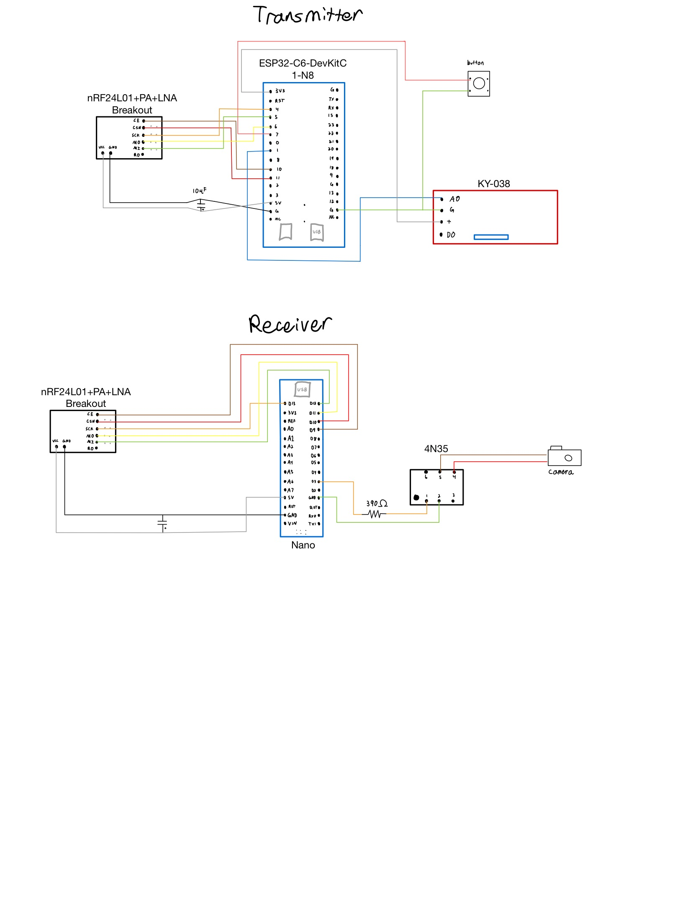

# Wireless Sound-Activated Camera Trigger
A sound-activated trigger for DSLR/mirrorless cameras. Designed specifically for rocket engine coldflows/hotfires.

## Overview
- Detects loud sound (compared to ambient level calibrated at startup)
- Trigger module sends a trigger via NRF24L01+
- Receiver module activates camera shutter using an optocoupler connected to intervalometer port.

## Transmitter
- ESP32-C6 DevKitC
- KY-038 analog microphone input
- NRF24L01+ wireless module (with breakout board)
- Auto-calibration on startup
- Manual trigger button for setup/testing
- LED feedback

## Receiver
- Arduino Nano
- NRF24L01+ wireless module (with breakout board)
- 4N35 optocoupler to trigger camera shutter by allowing current flow between trigger cable leads
 - This works with cameras like the Canon EOS R8 which rely on the two leads from the intervalometer port being shorted to trigger.
 - A camera that requires voltage or another signal would require modification.
 - 2.5mm to bare wire cables can be purchased for use.

## Setup
- Install Arduino libraries (RF24, Adafruit Neopixel)
- Upload code - Trigger code to ESP32 and Receiver code to Arduino Nano. Use the **Legacy Bootloader** if needed for your ESP32.
- Wire hardware using schematic below and connect power to both modules.
 - The NRF24L01+ breakout boards were used to simplify power delivery and reduce noise issues.
 - Be sure to check your camera's intervalometer trigger system—this will work if it only requires the two leads to be shorted.
 - Use the power connections as shown in the schematic; the RF modules and mic are sensitive to power weirdness.

## Schematic

Note the 10µF capacitors in parallel with power to both RF modules, and the 390Ω resistor between the Nano and 4N35 LED.
Both boards are powered via USB C. Current draw is minimal; will require low power mode on most power banks, otherwise they will automatically turn off.
