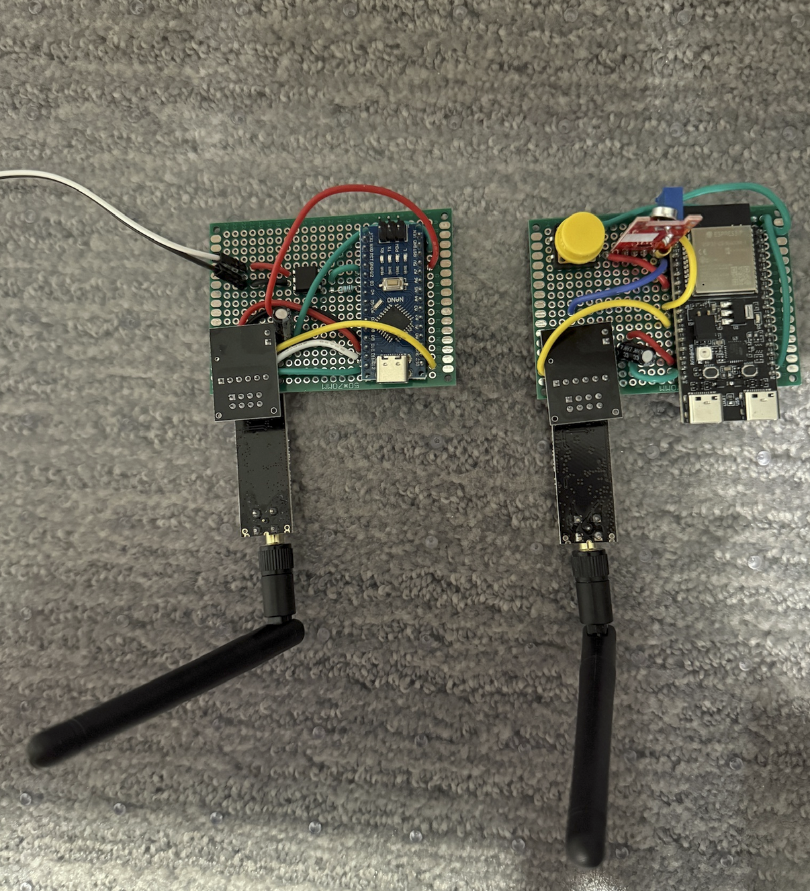

# Wireless Sound-Activated Camera Trigger
A sound-activated trigger for DSLR/mirrorless cameras. Designed specifically for rocket engine coldflows/hotfires.

## Overview
- Detects loud sound (compared to ambient level calibrated at startup)
- Trigger module sends a trigger via NRF24L01+
- Receiver module activates camera shutter using an optocoupler connected to intervalometer port.

## Transmitter
- ESP32-C6 DevKitC
- KY-038 analog microphone input
- NRF24L01+ wireless module (with breakout board)
- Auto-calibration on startup
- Manual trigger button for setup/testing
- LED feedback

## Receiver
- Arduino Nano
- NRF24L01+ wireless module (with breakout board)
- 4N35 optocoupler to trigger camera shutter by allowing current flow between trigger cable leads
 - This works with cameras like the Canon EOS R8 which rely on the two leads from the intervalometer port being shorted to trigger.
 - A camera that requires voltage or another signal would require modification.
 - 2.5mm to bare wire cables can be purchased for use.

## Schematic

